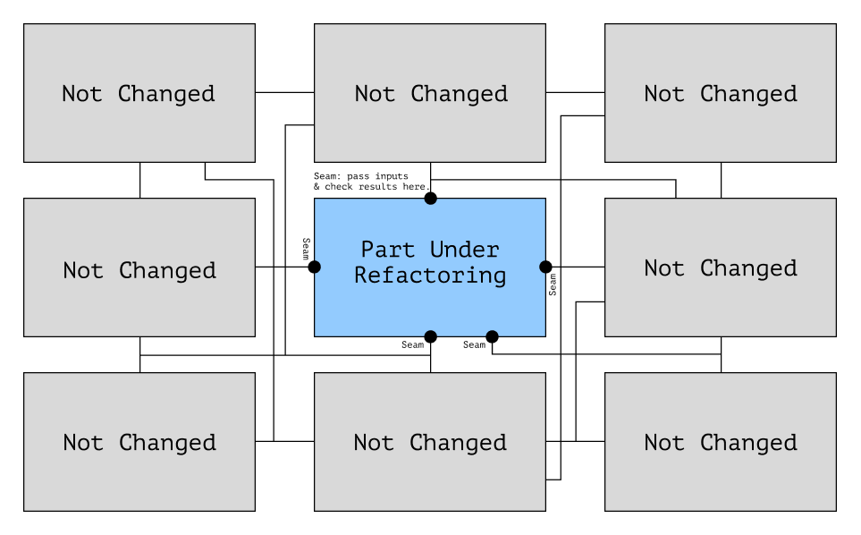

# Before Refactoring

To refactor code faster, without regressions, and without “too much extra work”, we need to first _study and prepare_ the code. In particular, we should:

- Define the refactoring scope and boundaries.
- Cover the code under refactoring with tests.
- Configure linters and, if needed, the compiler more strictly.

In this chapter, we'll discuss how to simplify why these steps are useful and how to simplify them.

## Define Scope and Boundaries

Refactoring should not take forever. Instead, it should be a limited chunk of work with clear boundaries and a definition of done. It's important for two reasons:

- We want to stay within our _time and resource budget_.
- Bounded changes are _easier to keep track of_ to see faster if they break the app.

Refactoring boundaries define the scope of work. They are the junction points between the code we're going to change and everything else. They show where our changes should stop, that is, what code _won't_ change.

Defining boundaries in the code isn't always obvious, especially if the modules are tightly coupled with each other. In such cases, paying attention to the _data and dependencies_ of the code can help.

The more different the data two pieces of code work with, the more likely they are different, independent parts of the program. The junction of these pieces is the boundary that should prevent changes from spreading across the whole code base.

| By the way 🪡                                                                                                                                        |
| :--------------------------------------------------------------------------------------------------------------------------------------------------- |
| Feathers in “Working Effectively with Legacy Code” calls these junctions “seams.”[^workingeffectively] Sometimes, I will use this term as a synonym. |

Boundaries prevent refactoring from taking forever and help you integrate changes into the main branch of the repository more often.

| In detail 🔬                                                                           |
| :------------------------------------------------------------------------------------- |
| We'll talk a little more about finding and using boundaries in the following chapters. |

## Cover with Tests

The code inside the boundaries must be covered with tests. We'll use them to constantly check if something was broken during refactoring. To make more use of the tests, I try to meet several conditions:

### Find More Edge Cases

Edge cases help avoid regressions and make sure we haven't broken the code in “exotic” circumstances. (“Exotic” bugs are much harder to fix.[^debugit])

The more diverse the edge cases, the easier it is to prepare and systematize test data for different situations. The knowledge of the application's behavior in these situations will come in handy in the future, even after refactoring.

### Define Explicit and Implicit Input

The explicit input is the arguments of functions or methods. The implicit input is dependencies, shared or global state, and the context of functions and methods. Systematization of input data will simplify test case creation.

### Specify Desired Result

During refactoring, we can't change the code functionality, so the desired result is the actual current behavior of the program. We can capture it as output data (e.g., the result of a function) or as a desired side effect (state change or API call).

Ideally, the result should exist _on the boundary_ of code under refactoring. Checking results on the boundary is easier while the amount of affected code is kept minimal.

### Set Up Automatic Tests

When refactoring, we want to test _every_ change, even a minuscule one. Manual testing can get tiresome. With manual testing, we might get lazy or just forget to test the changes.

Automatic tests don't have this problem. They can run in parallel while refactoring and re-test the code each time we save a file. That way, the test results are always in front of our eyes and we can notice faster what change has broken the code.

What type of tests to use depends on the situation and isn't as important as their existence. If unit tests are enough, we can use only them. If we have to test the work of several modules, we may need an integration or E2E test. The main point here is _automation_. The fewer checks we do by hand, the fewer human errors appear.

## Make Linter and Compiler Settings Stricter

This section is rather optional, but I, personally, like using it. In my opinion, more aggressive linter and compiler settings help spot occasional bugs and bad practices. “More aggressive” settings can include:

### “Errors” Instead of “Warnings”

Linter warnings are a collective experience of the industry. They can be valuable, but they're easy to miss because they don't make the code compilation “crash with an error”.

With errors, on the other hand, the code just “won't compile.” Errors will force us to update the code or change the linter rules we use.

| Keep in mind ❗️                                                                                                                                                                               |
| :--------------------------------------------------------------------------------------------------------------------------------------------------------------------------------------------- |
| Not all linter rules are equally useful. We can choose rules that we think are more important and discard others. However, once we have chosen a set of rules, we should follow them strictly. |

### Configure More Automated Checks

If the team wants to try out new linter rules or other automated tools, this is a great time to try.

But it's worth remembering that not all rules are equally useful and appropriate for every project. I try not to go against the team. If most of the other developers in the team think a particular linter rule is unnecessary, I wouldn't introduce it.

Teams can have debates about rules and practices to figure out most suitable for them. But remember that no rule is worth having a conflict in the team.

[^workingeffectively]: “Working Effectively with Legacy Code” by Michael C. Feathers, https://www.goodreads.com/book/show/44919.Working_Effectively_with_Legacy_Code
[^debugit]: “Debug It!: Find, Repair, and Prevent Bugs in Your Code” by Paul Butcher, https://www.goodreads.com/book/show/6770868-debug-it
